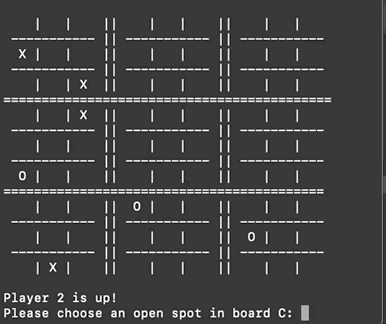

# ULTIMATE TIC TAC TOE

For my first Python project, I created a game of Ultimate Tic Tac Toe. This game draws upon the basic rules of Tic Tac Toe, but adds complexity to make it more strategy-driven.

Note: To start the game, please run the main.py file. 

## Running the Game

The game only uses libraries that are native to Python 3, so no further installations are needed.

# How to Play
If you prefer video instructions, [a helpful video by Youtube user MindYourDecisions](https://www.youtube.com/watch?v=37PC0bGMiTI)

## Written instructions per [Wikipedia](https://en.wikipedia.org/wiki/Ultimate_tic-tac-toe):

Each small 3-by-3 tic-tac-toe board is referred to as a local board, and the larger 3-by-3 board is referred to as the global board.

The game starts with X playing wherever they want in any of the 81 empty spots. This move 'sends' their opponent to its relative location. For example, if X played in the top right square of their local board, then O needs to play next in the local board at the top right of the global board. O can then play in any one of the nine available spots in that local board, each move sending X to a different local board.

If a move is played so that it is to win a local board by the rules of normal tic-tac-toe, then the entire local board is marked as a victory for the player in the global board.

Once the outcome of a local board is decided (win or draw), no more moves may be played in that board. If a player is sent to such a board, then that player may play in any other board.

Game play ends when either a player wins the global board or there are no legal moves remaining, in which case the game is a draw
